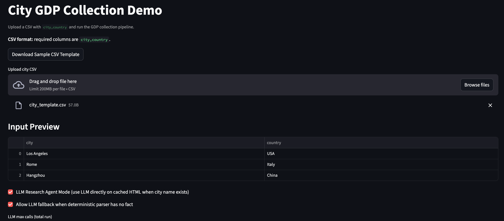

# GDP Collection - A reflective Agentic Pipline for data collection

## Project Scope
This tutorial builds a robust city-level GDP collection pipeline in the WAT framework (Workflow, Agents, Tools), as a refactor of `_script/04_gdp_collection`.

Scope includes:
- Processing city-country inputs and metro population metadata.
- Multi-query retrieval and candidate ranking with source-tier awareness.
- GDP fact extraction (`gdp_raw`, `year`, `currency`, `gdp_type`, `geo_level`) with bounded LLM fallback for ambiguous cases.
- Historical FX normalization to USD aligned with the data year.
- Validation-first gates for geography, evidence traceability, year, value range, plausibility, currency/FX, and source quality.
- Auditable outputs:
  - `data/output/gdp/r_city_gdp_candidates.csv`
  - `data/output/gdp/city_gdp_results.csv`
  - `data/output/gdp/run_evaluation.json`

## Learning Outcomes
By the end of this tutorial, you should be able to:
- Structure an agentic pipeline with clear workflow, agent, and deterministic tool responsibilities.
- Design retrieval and ranking logic for city-level economic data with source-quality awareness.
- Extract and normalize GDP evidence into a consistent schema with year-aware FX conversion.
- Apply strict validation gates to reduce extraction errors and hallucination risk.
- Implement checkpoint/resume logic for scalable, iterative city-level runs.
- Interpret run metrics and audit artifacts to debug quality issues and improve pipeline reliability.
- Choose when deterministic logic is sufficient and when bounded LLM usage is justified.

```mermaid
%%{init: {"flowchart": {"nodeSpacing": 18, "rankSpacing": 20, "diagramPadding": 4, "useMaxWidth": true}, "themeVariables": {"fontSize": "12px"}}}%%
graph LR
    A[Input City Country] --> B[Build Query Pack]
    B --> C[Primary Retrieval]
    C --> D{Intent Quota Met}
    D -- No --> E[Adaptive Expansion]
    D -- Yes --> F[Rank And Score]
    E --> F

    F --> G[Fetch And Cache]
    G --> H{Research Mode Enabled}

    H -- Yes --> I{City Mention Found}
    I -- Yes --> J[LLM First Extraction]
    I -- No --> K[Parser Extraction]
    J --> L{LLM Fact Found}
    L -- No --> K

    H -- No --> K
    K --> M{Parser Fact Found}
    M -- No --> N{Fallback Allowed And Budget}
    N -- Yes --> O[LLM Fallback Extraction]
    N -- No --> X[Reject Candidate]

    L -- Yes --> P[Normalize And FX]
    M -- Yes --> P
    O --> P

    P --> Q{Validation Gates Pass}
    Q -- Yes --> R[Accept Candidate]
    Q -- No --> X

    R --> S{Valid Row Exists}
    S -- Yes --> T[Select Final Row]
    S -- No --> U[Downscaled Fallback InReview]
    U --> T

    X --> V[Log Failure Trace]
    V --> S
```


# Folder structure
This folder is initialized to match `AGENTS.md` v2.2 structure for the WAT pipeline:
- `agents/`
- `tools/`
- `workflows/`
- `utils/`
- `.tmp/`

## Python Environment Setup
- Create a virtual environment (from this tutorial folder):
  `python3 -m venv .venv`
- Activate it (macOS/Linux):
  `source .venv/bin/activate`
- Upgrade pip (recommended):
  `python -m pip install --upgrade pip`
- Install dependencies:
  `python -m pip install -r requirements.txt`

## Google Colab Setup (Notebook + Working Directory)
- The notebook (`tutorial-1.ipynb`) expects the **working directory to be this folder**:
  `tutorials/01_city_gdp_collection/`
- This is required so local imports like `agents.*`, `tools.*`, and `utils.*` work correctly.

### Open in Colab + Clone the Repo
1. Open `tutorial-1.ipynb` in Google Colab (from GitHub or upload).
2. In a new Colab cell, clone the repo and move into the tutorial folder:
   ```python
   !git clone https://github.com/brookefzy/agents-for-urban-planning.git /content/agents-for-urban-planning
   %cd /content/agents-for-urban-planning/tutorials/01_city_gdp_collection
   !pip install -r requirements.txt
   ```
3. Re-open or run the notebook cells from that working directory.


### Colab Secrets / API Keys
- In Colab, store keys in **Secrets** (left sidebar > key icon), then add:
  - `TAVILY_API_KEY`
  - `OPENAI_API_KEY` (only needed if using LLM fallback / reflection cells)
- The notebook already tries to read Colab secrets automatically.

### Quick Working Directory Check (Colab)
- Run this in a cell before the tutorial if imports fail:
  ```python
  import os
  print(os.getcwd())
  !ls
  ```
- You should see files/folders like `agents/`, `tools/`, `utils/`, and `tutorial-1.ipynb`.

## Run scripts locally
- Run these commands from `tutorials/01_city_gdp_collection/` (the tutorial folder).
- Activate env: `source .venv/bin/activate`
- Run tests: `PYTHONPATH="." pytest tests -q`
- Run deterministic robustness regression harness:
  `PYTHONPATH="." pytest tests/regression/test_golden_cities.py -q`
- Execute dry run:
  `PYTHONPATH="." python -c "from workflows.run_gdp_pipeline import run_pipeline; print(run_pipeline(dry_run=True))"`
- Execute dry run for 10 different cities only (component evaluation mode):
  `PYTHONPATH="." python -c "from workflows.run_gdp_pipeline import run_pipeline; print(run_pipeline(dry_run=False, city_sample_size=10, search_engine='tavily'))"`
- Execute 10-city evaluation with SerpAPI:
  `PYTHONPATH="." python -c "from workflows.run_gdp_pipeline import run_pipeline; print(run_pipeline(dry_run=False, city_sample_size=10, search_engine='serpapi'))"`
- Execute 10-city evaluation with bounded LLM fallback enabled:
  `PYTHONPATH="." python -c "from workflows.run_gdp_pipeline import run_pipeline; print(run_pipeline(dry_run=False, city_sample_size=10, search_engine='tavily', urls_per_city_for_extraction=5, allow_llm_fallback=True, llm_model='openai:gpt-5-nano', llm_max_calls=10, output_suffix='tavily'))"`
- After a successful 10-city test, resume the same engine run for the full city list (skips already-saved cities in the same output file):
  `PYTHONPATH="." python -c "from workflows.run_gdp_pipeline import run_pipeline; print(run_pipeline(dry_run=False, search_engine='tavily', urls_per_city_for_extraction=5, allow_llm_fallback=True, llm_model='openai:gpt-5-nano', llm_max_calls=20, output_suffix='tavily', resume=True))"`
- Force a fresh search API call for a rerun (ignore cached search results for this engine/city set):
  `PYTHONPATH="." python -c "from workflows.run_gdp_pipeline import run_pipeline; print(run_pipeline(dry_run=False, city_sample_size=10, search_engine='tavily', use_search_cache=False, output_suffix='tavily_refresh'))"`

### Streamlit Web App (Demo) - Run Locally
1. Open terminal and go to this folder:
   `cd tutorials/01_city_gdp_collection`
2. Activate environment:
   `source .venv/bin/activate`
3. Install dependencies (first run or after updates):
   `python -m pip install -r requirements.txt`
4. Add API keys in local env file:
   `tutorials/01_city_gdp_collection/.env`
   ```bash
   TAVILY_API_KEY=your_tavily_key
   OPENAI_API_KEY=your_openai_key
   ```
5. Start the app:
   `streamlit run streamlit_app.py`
6. Open the local URL shown by Streamlit (typically `http://localhost:8501`).

Demo screenshot:



App usage:
- Click `Download Sample CSV Template` to get the expected file format.
- Upload a CSV with required columns: `city,country`.
- Demo cap: if the file has more than 3 rows, only the first 3 are processed.
- Optional mode: enable `LLM Research Agent Mode` to run direct LLM extraction on cached HTML (when city name is present in the document).
- Toggle `Allow LLM fallback` to control whether non-research-mode runs can call LLM after deterministic parser misses.
- Tune LLM budget in UI:
  - `LLM max calls (total run)`
  - `LLM max calls (per city)`
  - optional parser fallback when research-mode LLM fails
- Click `Run GDP Collection` to see:
  - `Process Trace` table (agent-by-agent rows with candidate URL and status),
  - live log summary,
  - final results and download outputs.

## Env
- Expected API keys in `.env` (inside `tutorials/01_city_gdp_collection/`):
  - `TAVILY_API_KEY`
  - `SERPAPI_KEY`
- Behavior when missing: search layer reports degraded mode and returns deterministic error rows rather than crashing.
  - For `run_pipeline(dry_run=False)`, default is **fail-fast** on missing key for selected `search_engine` (`fail_on_missing_search_keys=True`).

## Logs
- Run-level metrics/log summary:
  - `data/output/gdp/run_evaluation*.json`
- Fetch/cache trace artifacts:
  - `.tmp/fetch_cache/`
- Search result cache (per search engine, per city-country):
  - `.tmp/search_cache/`
- Current status:
  - No dedicated rotating application log file yet; pipeline audit is captured via `run_evaluation.json` and cached fetch artifacts.

## Final Outputs
- Candidate-level output:
  - `data/output/gdp/r_city_gdp_candidates*.csv`
- Final selected output (1 row per city-country):
  - `data/output/gdp/city_gdp_results*.csv`
- Run evaluation/metrics:
  - `data/output/gdp/run_evaluation*.json`

### LLM Tracking Fields
Candidate/final outputs include:
- `llm_attempted`: whether an LLM call was attempted for that candidate row.
- `llm_used`: whether LLM produced a usable extracted GDP fact.
- `llm_status`: canonical status (`not_attempted`, `attempted_no_fact`, `used`).
- `llm_error`: explicit error/diagnostic for attempted LLM rows, or `none`.
- `country_consistency`: retrieval prefilter tag (`matched`, `mismatch`, `fallback`, `unknown`).
- `repair_actions`: extraction repair trace (`none` or semicolon-delimited actions).
- New retrieval guard failure reasons include:
  - `candidate_not_city_gdp_intent`
  - `candidate_country_level_only`

## Tunable Parameters
- Runtime function parameters (pass into `run_pipeline(...)`) in `workflows/run_gdp_pipeline.py`:
  - `dry_run`
  - `top_k`
  - `limit`
  - `city_sample_size`
  - `search_engine` (`tavily` or `serpapi`)
  - `urls_per_city_for_extraction` (default `5`; number of URLs to evaluate per city before fallback)
  - `max_urls_to_try_per_city` (default `20`; scan up to this many ranked URLs to find `urls_per_city_for_extraction` intent-valid candidates)
  - `fail_on_missing_search_keys` (default `True`)
  - `allow_llm_fallback` (default `False`)
  - `allow_rendered_fallback` (default `False`; optional JS-rendered content fallback hook for dynamic pages)
  - `llm_research_agent_mode` (default `False`; if `True`, cache HTML, verify city mention, then use LLM extraction directly instead of deterministic parser)
  - `parser_fallback_when_llm_research_fails` (default `True`; if research-mode LLM returns no fact, try deterministic parser)
  - `llm_model` (default `openai:gpt-5-nano`; e.g., `openai:gpt-5-nano`, `anthropic:claude-3-5-sonnet-20241022`)
  - `llm_max_calls` (hard cap for fallback calls per run)
  - `llm_max_calls_per_city` (optional cap to avoid one city consuming all LLM budget)
  - `use_checkpoint` (`None` default means: `False` for sample runs with `city_sample_size`, otherwise `True`)
  - `resume` (default `False`; loads existing candidate CSV for the same `output_suffix`, skips already-processed city-country pairs, and appends new rows)
  - `use_search_cache` (default `True`; reuse cached search results per `(city, country, search_engine)` to avoid repeat API calls)
  - `output_suffix` (writes outputs as `*_suffix.csv/json` for engine comparisons)
- Validation thresholds in `utils/config.py`:
  - `city_gdp_year_min`, `year_max`
  - `min_gdp_usd`, `max_gdp_usd`
  - `min_gdp_per_capita`, `max_gdp_per_capita`
- Trusted domains and source-tier mapping in `utils/source_tiering.py`:
  - `TIER1_DOMAINS`
  - `TIER2_DOMAINS`
  - `get_source_tier(...)` classification rules
- Pre-fetch ranking/scoring weights in `utils/ranking.py`:
  - `_TIER_SCORE`
  - keyword relevance list `_KEYWORDS`
  - provisional `weighted_quality_score(...)` (`TODO(source_tier_mapping)`)

## Extraction Notes
- `ExtractorAgent` now supports:
  - HTML table-aware parsing (GDP from table cells with header/context scaling hints).
  - Multi-candidate extraction and best-candidate selection by confidence and year, instead of first-match return.
  - Currency inference via symbol/country context (e.g., `€`, `¥`, `₹`, country hints).
  - Year guardrails during extraction (`city_gdp_year_min` to `year_max`) to avoid future-year artifacts.
  - Blocked domains are ignored at search stage (e.g., `youtube.com`, `youtu.be`).

## LLM Usage
- Core pipeline path is deterministic by default.
- `agents/search.py::find_references(...)` has `allow_llm=False` by default; no LLM call unless explicitly enabled.
- Core workflow now supports bounded extraction fallback when deterministic extraction fails:
  - `run_pipeline(..., allow_llm_fallback=True, llm_max_calls=N)`
  - Row-level attribution fields are set: `method=llm_fallback`, `llm_used=True`, `model_name=<selected model>`
  - LLM calls use exponential backoff for rate-limit errors (429/Too Many Requests).

## Validation Notes
- `EvaluatorAgent` includes a deterministic hallucination audit:
  - checks that extracted GDP value is traceable in source/evidence text (raw or scaled forms like `100 billion`).
  - audit is applied to `method=llm_fallback` rows only.
  - geography checks reject direct parser rows when full source content does not mention the target city.

## Robustness Runbook
- Use `docs/plans/robustness-runbook.md` for failure taxonomy definitions and step-by-step triage.

## Fallback Notes
- If no valid city-level candidate passes for a city, pipeline attempts a country-level downscaled fallback:
  - source: World Bank GDP per-capita (`NY.GDP.PCAP.CD`)
  - formula: `country_gdp_per_capita_usd * metro_population`
  - row tagging: `method=downscaled_fallback`, `status=inReview`

### FX Fallback Notes
- `tools/fx_rates.py` first uses deterministic in-repo FX tables.
- If a currency is not covered in the table, it now triggers web-search fallback (Tavily) to parse a quoted rate from search snippets.
- Supported quote parsing:
  - direct: `1 CUR = X USD`
  - inverse: `1 USD = X CUR` (converted to `1/X`)
- This fallback is best-effort and still deterministic in code path; if no parseable quote is found, FX remains unavailable and validation should fail clearly.

## Search Cache Notes
- `use_search_cache=True` (default) is recommended when:
  - rerunning the same city sample with the same `search_engine`
  - iterating on extraction/normalization/evaluation logic and you want stable URL candidates
  - reducing API cost and latency during repeated experiments
- Use `use_search_cache=False` when:
  - you want a fresh search query after changing search prompts/query templates
  - you suspect cached results are stale or low quality
  - you are benchmarking retrieval changes and need new API responses (same engine)
- Cache is separated by search engine, so Tavily and SerpAPI runs do not share cached search results.

## Resume Notes
- Use `resume=True` after a sample run (e.g., `city_sample_size=10`) when you want to continue to the full city list without reprocessing those sample cities.
- `resume=True` works against the current output files, so keep the same `output_suffix` for the same engine run (for example `output_suffix='tavily'`).
- `resume=True` implies checkpoint skipping from the existing candidate CSV for that output file.
- `resume=True` skips only city-country pairs that already have a usable result (for example `status=ok`, `status=inReview`, or a row with `gdp_raw/gdp_usd` populated).
- Cities that previously produced only failed/no-value rows (for example `extraction_no_fact`) are re-queued automatically on resume.
- If you want to reprocess previously saved cities, set `resume=False` (or use a different `output_suffix`).
