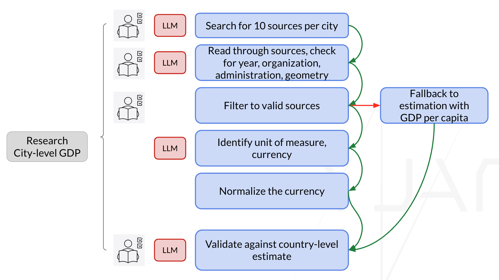

```mermaid
%%{init: {"flowchart": {"nodeSpacing": 18, "rankSpacing": 20, "diagramPadding": 4, "useMaxWidth": true}, "themeVariables": {"fontSize": "12px"}}}%%
graph LR
    A[Input City Country] --> B[Build Query Pack]
    B --> C[Primary Retrieval]
    C --> D{Intent Quota Met}
    D -- No --> E[Adaptive Expansion]
    D -- Yes --> F[Rank And Score]
    E --> F

    F --> G[Fetch And Cache]
    G --> H{Research Mode Enabled}

    H -- Yes --> I{City Mention Found}
    I -- Yes --> J[LLM First Extraction]
    I -- No --> K[Parser Extraction]
    J --> L{LLM Fact Found}
    L -- No --> K

    H -- No --> K
    K --> M{Parser Fact Found}
    M -- No --> N{Fallback Allowed And Budget}
    N -- Yes --> O[LLM Fallback Extraction]
    N -- No --> X[Reject Candidate]

    L -- Yes --> P[Normalize And FX]
    M -- Yes --> P
    O --> P

    P --> Q{Validation Gates Pass}
    Q -- Yes --> R[Accept Candidate]
    Q -- No --> X

    R --> S{Valid Row Exists}
    S -- Yes --> T[Select Final Row]
    S -- No --> U[Downscaled Fallback InReview]
    U --> T

    X --> V[Log Failure Trace]
    V --> S
```

# Tutorial 1: City GDP Collection - Reflective Agentic Pipeline

Build an auditable city-level GDP collection workflow using the WAT pattern (Workflow, Agents, Tools), with deterministic extraction first and bounded LLM fallback for hard cases.


## Why this tutorial
City GDP data is scattered across mixed-quality sources, inconsistent formats, and different reporting years. This tutorial shows how to design a pipeline that is:
- reliable: validation gates reduce extraction and normalization errors,
- transparent: every accepted output can be traced back to source evidence,
- practical: supports local runs, Colab runs, and a Streamlit demo app.

## Who this is for
- Urban planners and policy analysts exploring AI-supported data workflows.
- Students learning agentic workflow design beyond simple prompting.
- Data/AI practitioners who want reproducible extraction + validation pipelines.

## Learning outcomes
By the end of this tutorial, you should be able to:
- Design a reflective agentic workflow with clear workflow-agent-tool boundaries.
- Rank and triage noisy web candidates with source-quality awareness.
- Extract structured GDP facts and normalize by year-aware FX conversion.
- Apply validation-first gates to improve reliability and reduce hallucination risk.
- Interpret run artifacts to audit and debug pipeline behavior.

## Reflective agentic pipeline
Use this image to explain the core concept in class or online:



Plain-language flow:
1. Build and expand query packs until coverage intent is sufficient.
2. Rank candidates, fetch/cache pages, and run extraction.
3. Prefer deterministic parser logic; use bounded LLM fallback only when needed.
4. Normalize values and apply strict validation gates.
5. Keep only accepted rows and retain trace artifacts for review.

<details>
<summary>Mermaid flow (technical view)</summary>



</details>

## Quick start (local, 10 minutes)
Run from this folder: `tutorials/01_city_gdp_collection/`

```bash
python3 -m venv .venv
source .venv/bin/activate
python -m pip install --upgrade pip
python -m pip install -r requirements.txt
PYTHONPATH="." python -c "from workflows.run_gdp_pipeline import run_pipeline; print(run_pipeline(dry_run=True))"
```

## Quick start (Google Colab)
1. Open `tutorial-1.ipynb` in Colab.
2. In a new cell, run:

```python
!git clone https://github.com/brookefzy/agents-for-urban-planning.git /content/agents-for-urban-planning
%cd /content/agents-for-urban-planning/tutorials/01_city_gdp_collection
!pip install -r requirements.txt
```

3. Add Colab secrets:
- `TAVILY_API_KEY`
- `OPENAI_API_KEY` (needed only for LLM fallback/research-mode cells)

4. Confirm working directory if imports fail:

```python
import os
print(os.getcwd())
!ls
```

## Run modes
| Mode | Purpose | Command |
|---|---|---|
| Dry run | Smoke test without full collection | `PYTHONPATH="." python -c "from workflows.run_gdp_pipeline import run_pipeline; print(run_pipeline(dry_run=True))"` |
| 10-city eval (Tavily) | Fast component evaluation | `PYTHONPATH="." python -c "from workflows.run_gdp_pipeline import run_pipeline; print(run_pipeline(dry_run=False, city_sample_size=10, search_engine='tavily'))"` |
| 10-city eval (SerpAPI) | Compare search engine behavior | `PYTHONPATH="." python -c "from workflows.run_gdp_pipeline import run_pipeline; print(run_pipeline(dry_run=False, city_sample_size=10, search_engine='serpapi'))"` |
| 10-city eval + LLM fallback | Test bounded LLM assistance | `PYTHONPATH="." python -c "from workflows.run_gdp_pipeline import run_pipeline; print(run_pipeline(dry_run=False, city_sample_size=10, search_engine='tavily', urls_per_city_for_extraction=5, allow_llm_fallback=True, llm_model='openai:gpt-5-nano', llm_max_calls=10, output_suffix='tavily'))"` |
| Resume full run | Continue from saved city rows | `PYTHONPATH="." python -c "from workflows.run_gdp_pipeline import run_pipeline; print(run_pipeline(dry_run=False, search_engine='tavily', urls_per_city_for_extraction=5, allow_llm_fallback=True, llm_model='openai:gpt-5-nano', llm_max_calls=20, output_suffix='tavily', resume=True))"` |

## Outputs you get
| Artifact | Path |
|---|---|
| Candidate-level rows | `data/output/gdp/r_city_gdp_candidates*.csv` |
| Final city-level rows | `data/output/gdp/city_gdp_results*.csv` |
| Run metrics and evaluation | `data/output/gdp/run_evaluation*.json` |
| Fetch cache | `.tmp/fetch_cache/` |
| Search cache | `.tmp/search_cache/` |

## Streamlit demo app (optional)
```bash
cd tutorials/01_city_gdp_collection
source .venv/bin/activate
python -m pip install -r requirements.txt
streamlit run streamlit_app.py
```

Local env file:

```bash
# tutorials/01_city_gdp_collection/.env
TAVILY_API_KEY=your_tavily_key
OPENAI_API_KEY=your_openai_key
```

App highlights:
- Download sample CSV template and upload `city,country` input.
- Demo cap processes first 3 rows when input is larger.
- Toggle research mode and LLM fallback from UI.
- View process trace, logs, final results, and downloadable outputs.

## Environment variables
Expected in `.env`:
- `TAVILY_API_KEY`
- `SERPAPI_KEY`

Behavior when keys are missing:
- Pipeline degrades gracefully with deterministic error rows.
- For `run_pipeline(dry_run=False)`, default is fail-fast for missing key of selected `search_engine` (`fail_on_missing_search_keys=True`).

## Folder structure
This tutorial uses:
- `agents/`
- `tools/`
- `workflows/`
- `utils/`
- `.tmp/`

## Troubleshooting
- Run commands from `tutorials/01_city_gdp_collection/` to avoid import path issues.
- If tests/imports fail, ensure `PYTHONPATH="."` is set exactly as shown.
- If search fails unexpectedly, verify API keys and selected `search_engine`.

<details>
<summary>Advanced configuration and technical fields</summary>

### Tunable parameters
Runtime parameters are passed into `run_pipeline(...)` in `workflows/run_gdp_pipeline.py`:
- `dry_run`
- `top_k`
- `limit`
- `city_sample_size`
- `search_engine` (`tavily` or `serpapi`)
- `urls_per_city_for_extraction` (default `5`)
- `max_urls_to_try_per_city` (default `20`)
- `fail_on_missing_search_keys` (default `True`)
- `allow_llm_fallback` (default `False`)
- `allow_rendered_fallback` (default `False`)
- `llm_research_agent_mode` (default `False`)
- `parser_fallback_when_llm_research_fails` (default `True`)
- `llm_model` (default `openai:gpt-5-nano`)
- `llm_max_calls`
- `llm_max_calls_per_city`
- `use_checkpoint`
- `resume` (default `False`)
- `use_search_cache` (default `True`)
- `output_suffix`

Validation thresholds in `utils/config.py`:
- `city_gdp_year_min`, `year_max`
- `min_gdp_usd`, `max_gdp_usd`
- `min_gdp_per_capita`, `max_gdp_per_capita`

Trusted domains and source tiers in `utils/source_tiering.py`:
- `TIER1_DOMAINS`
- `TIER2_DOMAINS`

### LLM tracking fields
Candidate/final outputs include:
- `llm_attempted`
- `llm_used`
- `llm_status` (`not_attempted`, `attempted_no_fact`, `used`)
- `llm_error`
- `country_consistency` (`matched`, `mismatch`, `fallback`, `unknown`)
- `repair_actions`

Retrieval guard failure examples:
- `candidate_not_city_gdp_intent`
- `candidate_country_level_only`

### Additional regression commands
```bash
PYTHONPATH="." pytest tests -q
PYTHONPATH="." pytest tests/regression/test_golden_cities.py -q
PYTHONPATH="." python -c "from workflows.run_gdp_pipeline import run_pipeline; print(run_pipeline(dry_run=False, city_sample_size=10, search_engine='tavily', use_search_cache=False, output_suffix='tavily_refresh'))"
```

</details>
